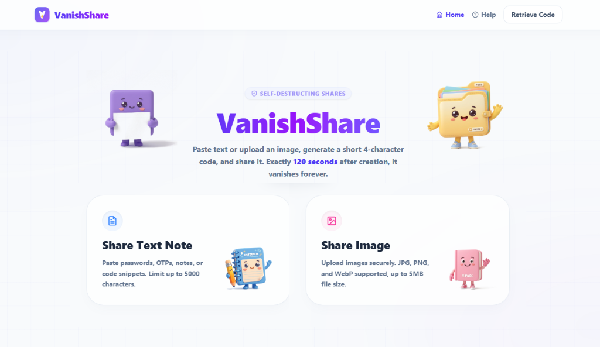
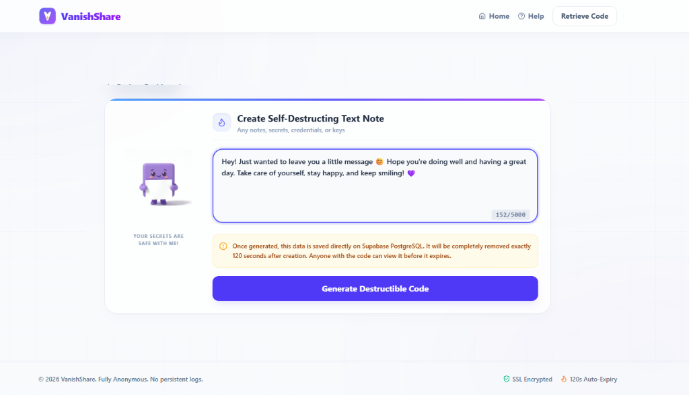
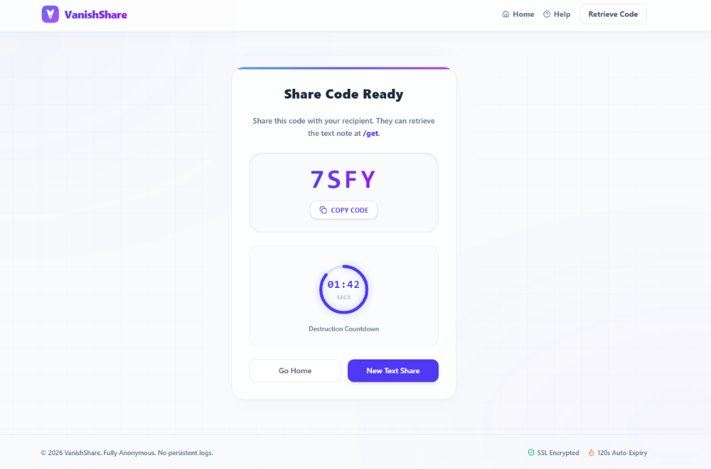
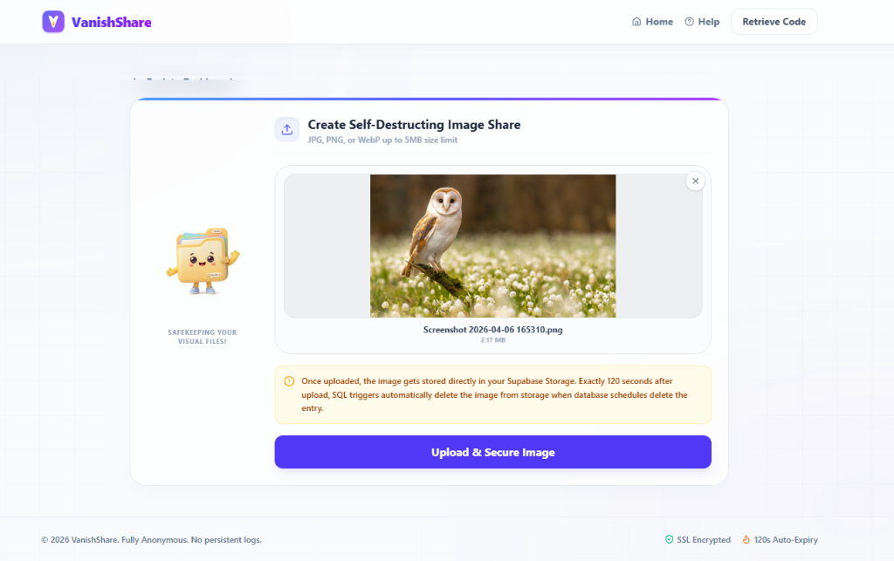
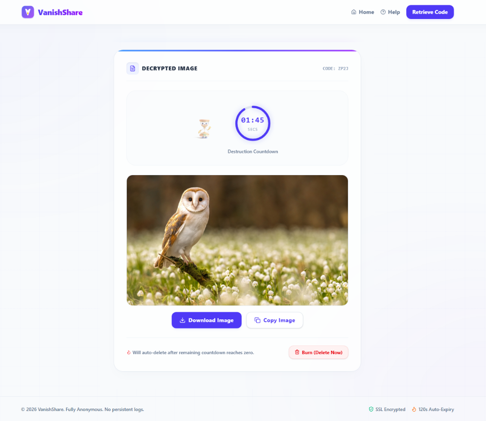

  

<h1 align="center">🚀 VanishShare</h1>

  <b>Secure, Self-Destructing Text & Image Sharing</b> 
  Share confidential information without leaving a digital footprint.

---

## 🔒 Why Use VanishShare?

In today's digital landscape, sharing secrets over email, Slack, or chat apps is risky. These platforms keep permanent logs of your messages, leaving them vulnerable to data breaches. VanishShare solves this with:

| Feature | Benefit |
| ------- | ------- |
| 🕵️ **100% Anonymity** | No sign-up, no login, and no user tracking. We collect zero persistent log files, browser cookies, or IP details. |
| ⏳ **Auto-Expiry Purge** | Every note or image automatically self-destructs exactly **120 seconds** after you create it. |
| 🔥 **Immediate Voluntary Burn** | Receivers can immediately wipe data on the spot by clicking the **"Burn (Delete Now)"** button. |
| 🛡️ **Security-First Media** | All screenshots and interface elements are protected from dragging, selecting, or copy-pasting to prevent accidental exposure. |

---

## 📖 How to Use VanishShare

Whether you need to share a password, database credentials, an API token, or a sensitive image, VanishShare encrypts your share, creates a temporary access code, and purges it completely from our database and cloud storage exactly **120 seconds** after creation.

### Step 1 — Open the Dashboard & Choose Share Type
On the main dashboard, select whether you want to share a secure text note or upload an image file.

### Step 2 — Create a Secret Note
Write or paste your secure credential, note, password, or code snippet (up to 5000 characters).

### Step 3 — Copy Your Access Code
Generate a unique **4-character access code**. Copy the code and send it to your recipient. Notice the real-time circular countdown clock showing exactly when the secret will expire.

### Step 4 — Share Images Securely
If sharing an image, drop your JPG, PNG, or WebP file (up to 5MB) into the upload card.

### Step 5 — Retrieve & Destruct
Your recipient inputs the 4-character code to decrypt and view the secret. They can immediately download the content or click **"Burn (Delete Now)"** to permanently erase the secret from all servers instantly.

---

## 🛡️ Privacy Statement

VanishShare does not log secrets. All database rows and storage bucket files are programmatically wiped clean immediately upon expiration or deletion. **Once burned, your secrets are gone forever.**
